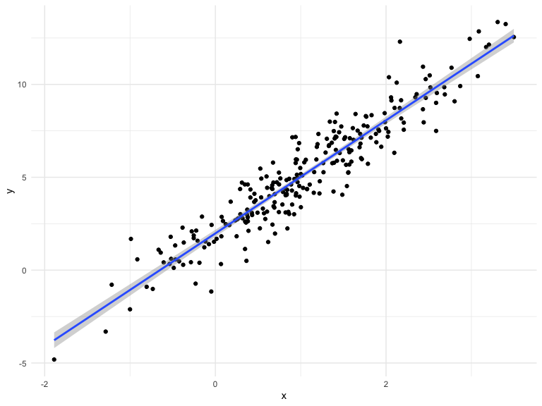
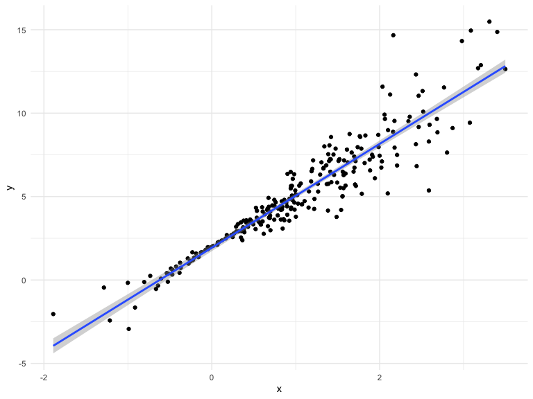
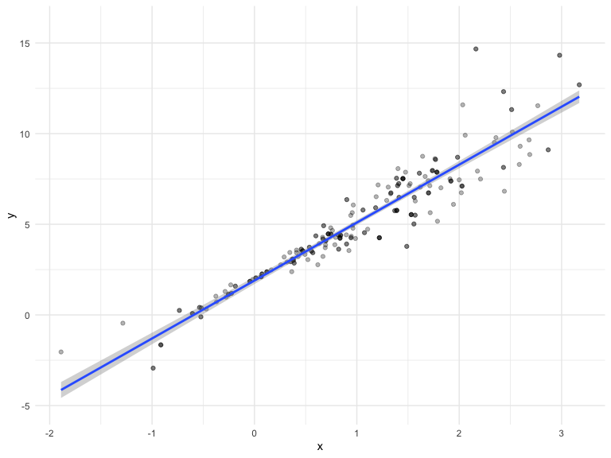
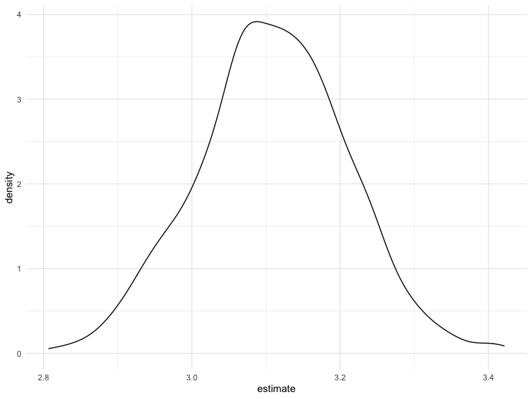
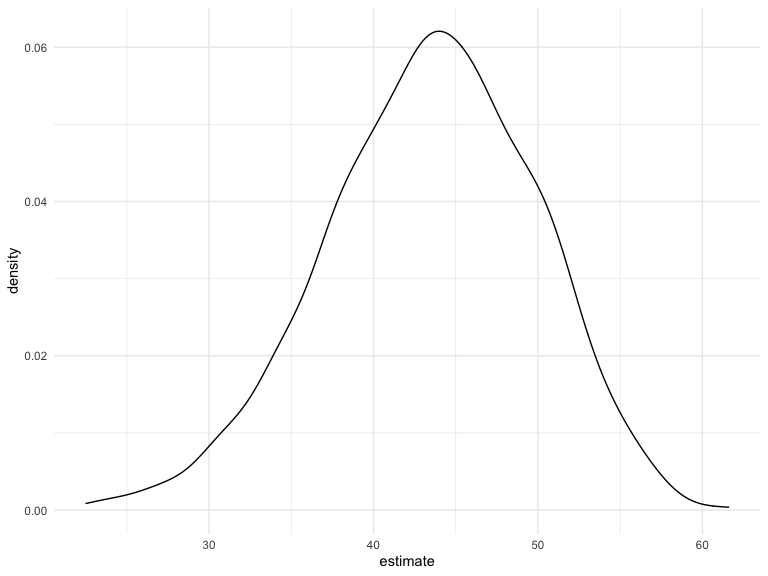

DSlecture20
================
Hening CUi
11/29/2021

    ## ── Attaching packages ─────────────────────────────────────── tidyverse 1.3.1 ──

    ## ✓ ggplot2 3.3.5     ✓ purrr   0.3.4
    ## ✓ tibble  3.1.5     ✓ dplyr   1.0.7
    ## ✓ tidyr   1.1.4     ✓ stringr 1.4.0
    ## ✓ readr   2.0.2     ✓ forcats 0.5.1

    ## ── Conflicts ────────────────────────────────────────── tidyverse_conflicts() ──
    ## x dplyr::filter() masks stats::filter()
    ## x dplyr::lag()    masks stats::lag()

simulate data

``` r
n_samp = 250

sim_df_const = 
  tibble(
    x = rnorm(n_samp, 1, 1),
    error = rnorm(n_samp, 0, 1),
    y = 2 + 3 * x + error
  )

sim_df_nonconst = sim_df_const %>% 
  mutate(
  error = error * .75 * x,
  y = 2 + 3 * x + error
)
```

plot the dataset

``` r
sim_df_const %>% 
  ggplot(aes(x, y)) +
  geom_point() +
  geom_smooth(method = "lm")
```

    ## `geom_smooth()` using formula 'y ~ x'



``` r
sim_df_nonconst %>% 
  ggplot(aes(x, y)) +
  geom_point() +
  geom_smooth(method = "lm")
```

    ## `geom_smooth()` using formula 'y ~ x'



``` r
lm(y ~ x, data = sim_df_const) %>% broom::tidy()
```

    ## # A tibble: 2 × 5
    ##   term        estimate std.error statistic   p.value
    ##   <chr>          <dbl>     <dbl>     <dbl>     <dbl>
    ## 1 (Intercept)     1.98    0.0981      20.2 3.65e- 54
    ## 2 x               3.04    0.0699      43.5 3.84e-118

``` r
lm(y ~ x, data = sim_df_nonconst) %>% broom::tidy()
```

    ## # A tibble: 2 × 5
    ##   term        estimate std.error statistic   p.value
    ##   <chr>          <dbl>     <dbl>     <dbl>     <dbl>
    ## 1 (Intercept)     1.93    0.105       18.5 1.88e- 48
    ## 2 x               3.11    0.0747      41.7 5.76e-114

## draw one bootstrap

``` r
boot_sample = function(df){
  sample_frac(df, replace = TRUE) %>% 
    arrange(x)
}
```

check if this works

``` r
boot_sample(sim_df_nonconst) %>% 
  ggplot(aes(x, y)) +
  geom_point(alpha= 0.3) +
  geom_smooth(method = "lm") +
  ylim(-5, 16)
```

    ## `geom_smooth()` using formula 'y ~ x'



``` r
boot_sample(sim_df_nonconst) %>% 
  lm(y ~ x, data = .) %>% 
  broom::tidy()
```

    ## # A tibble: 2 × 5
    ##   term        estimate std.error statistic   p.value
    ##   <chr>          <dbl>     <dbl>     <dbl>     <dbl>
    ## 1 (Intercept)     1.90    0.0982      19.3 2.45e- 51
    ## 2 x               3.14    0.0688      45.6 1.18e-122

## many sample and analysis

``` r
boot_stramp =
  tibble(
    stramp_number = 1:1000,
    stramp_sample = rerun(1000, boot_sample(sim_df_nonconst))
  )
```

run analysis

``` r
bootresult =
  boot_stramp %>% 
  mutate(
    models = map(.x = stramp_sample, ~lm(y ~ x, data = .x)),
    results = map(models, broom::tidy)
  ) %>% 
  select(stramp_number, results) %>% 
  unnest(results)
```

what do i have now

``` r
bootresult %>% 
  group_by(term) %>% 
  summarize(
    mean_es = mean(estimate),
    sd_es = sd(estimate)
  )
```

    ## # A tibble: 2 × 3
    ##   term        mean_es  sd_es
    ##   <chr>         <dbl>  <dbl>
    ## 1 (Intercept)    1.93 0.0748
    ## 2 x              3.11 0.101

look at the distribution

``` r
bootresult %>% 
  filter(term == "x") %>% 
  ggplot(aes(x = estimate)) +
  geom_density() 
```



construct bootstrap CI

``` r
bootresult %>% 
  group_by(term) %>% 
  summarize(
    ci_lower = quantile(estimate, 0.025),
    ci_upper = quantile(estimate,0.975)
  )
```

    ## # A tibble: 2 × 3
    ##   term        ci_lower ci_upper
    ##   <chr>          <dbl>    <dbl>
    ## 1 (Intercept)     1.79     2.08
    ## 2 x               2.91     3.31

## bootstrap using modelr

can we simplify anything

``` r
sim_df_nonconst %>% 
  bootstrap(1000, id = "stramp_number")%>% 
  mutate(
    models = map(.x = strap, ~lm(y ~ x, data = .x)),
    results = map(models, broom::tidy)
  ) %>% 
  select(stramp_number, results) %>% 
  unnest(results) %>% 
  group_by(term) %>% 
  summarize(
    mean_es = mean(estimate),
    sd_es = sd(estimate)
  )
```

    ## # A tibble: 2 × 3
    ##   term        mean_es  sd_es
    ##   <chr>         <dbl>  <dbl>
    ## 1 (Intercept)    1.93 0.0762
    ## 2 x              3.11 0.104

## revisit nyc airbnb

``` r
data("nyc_airbnb")

nyc_airbnb = 
  nyc_airbnb %>% 
  mutate(stars = review_scores_location / 2) %>% 
  rename(
    borough = neighbourhood_group,
    neighborhood = neighbourhood) %>% 
  filter(borough != "Staten Island") %>% 
  drop_na(price, stars) %>% 
  select(price, stars, borough, neighborhood, room_type)
```

``` r
nyc_airbnb %>% 
  ggplot(aes( x = stars, y = price)) +
  geom_point()
```


``` r
air_boot =
  nyc_airbnb %>% 
  filter(borough == "Manhattan") %>% 
  drop_na(stars) %>% 
  bootstrap(1000, id = "stramp_number")%>% 
  mutate(
    models = map(.x = strap, ~lm(price ~ stars, data = .x)),
    results = map(models, broom::tidy)
  ) %>% 
  select(stramp_number, results) %>% 
  unnest(results)
```

``` r
air_boot %>% 
  group_by(term) %>% 
  summarize(
    mean_es = mean(estimate),
    sd_es = sd(estimate)
  )
```

    ## # A tibble: 2 × 3
    ##   term        mean_es sd_es
    ##   <chr>         <dbl> <dbl>
    ## 1 (Intercept)   -35.0 31.3 
    ## 2 stars          43.4  6.34

compare to lm

``` r
nyc_airbnb %>% 
  filter(borough == "Manhattan") %>% 
  drop_na(stars) %>%
  lm(price ~ stars, data = .) %>% 
  broom::tidy()
```

    ## # A tibble: 2 × 5
    ##   term        estimate std.error statistic  p.value
    ##   <chr>          <dbl>     <dbl>     <dbl>    <dbl>
    ## 1 (Intercept)    -34.3     22.9      -1.50 1.35e- 1
    ## 2 stars           43.3      4.78      9.07 1.39e-19

``` r
air_boot %>% 
  filter(term == "stars") %>% 
  ggplot(aes(x = estimate)) +
  geom_density()
```


